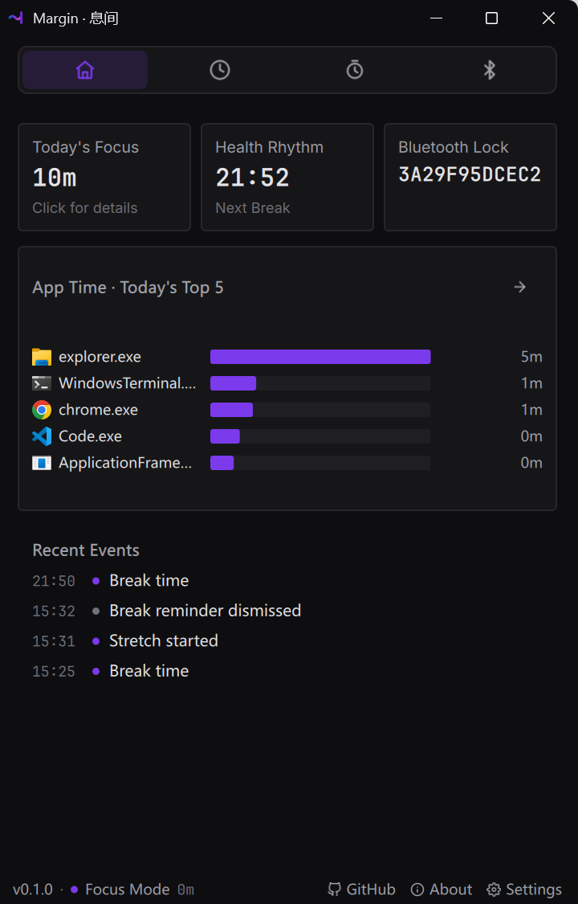
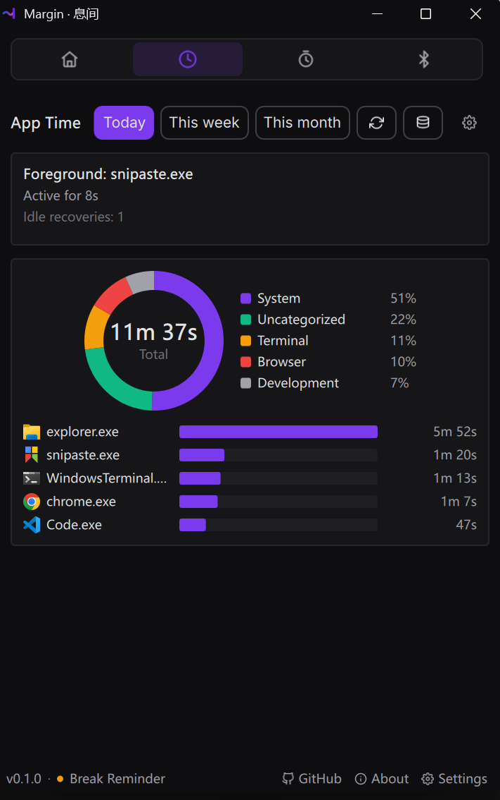
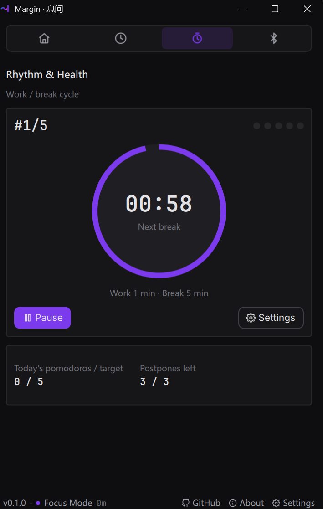
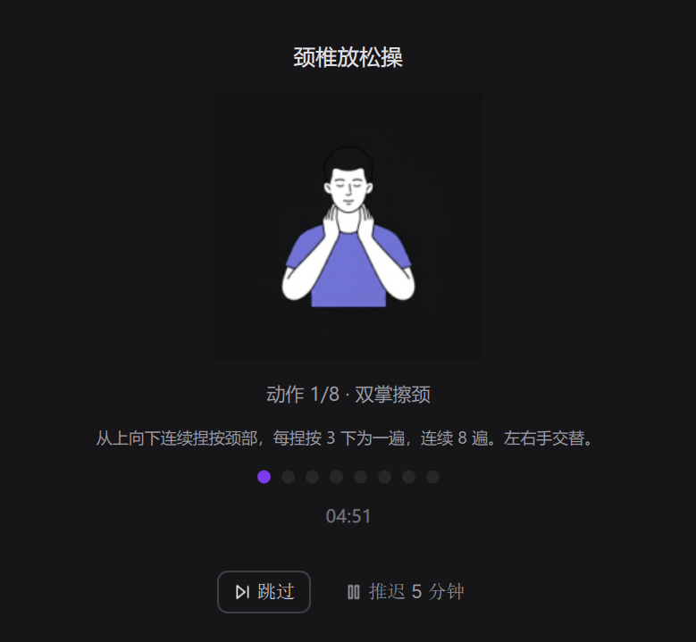
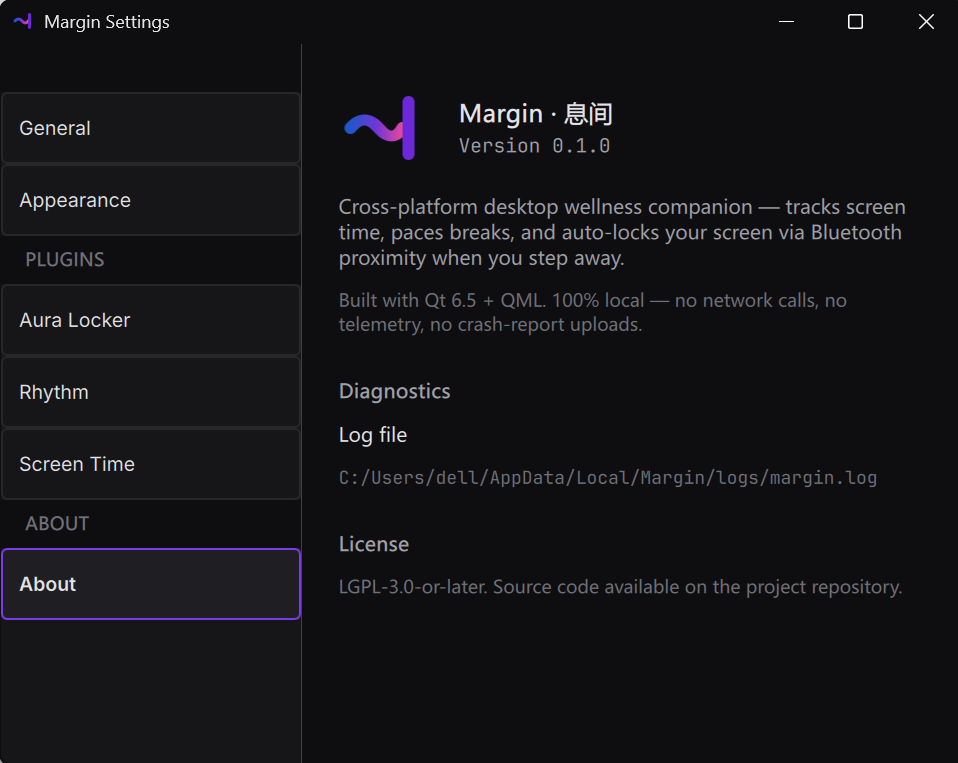

# Margin / 息间

  

  光标留白,是"息间";托盘一隅,是"Margin"。 
  余白养神,边界护心。

  <em>The cursor's pause is "息间"; the tray's corner is "Margin". 
  Where margins nurture the mind, and boundaries guard the heart.</em>

  

---

一个常驻系统托盘的轻量级桌面应用,关注开发者与高强度电脑使用者的
数字健康。Host + Plugin + EventBus 架构,**绝对本地化、零网络、开源透明**。

---

## What is this (English short)

Margin is a cross-platform Qt 6 / C++ / QML desktop companion that lives in the
system tray. It is built around three pillars of digital health:

- **Aura Locker** — auto-lock the workstation when a paired Bluetooth device
  (phone, watch, headphone) moves out of range.
- **Screen Time Tracker** — passive foreground-app duration logging with
  field-level AES-256-GCM encryption for sensitive window titles.
- **Rhythm & Health** — pomodoro timer with guided stretch breaks; pauses when
  Aura reports the user stepped away.

100% on-device. Zero network calls, zero telemetry, no accounts. Source under
LGPL-3.0-or-later. Windows 10 1809+ supported today; macOS backend is in
progress for v1.1.

---

## 这是什么

Margin 通过插件化架构提供三件与久坐 / 注意力 / 隐私相关的事。当前阶段:
**Phase 1 MVP v0.1.0(2026-06-19)已发布**,Windows 端 4 个 Tab 全部上线;
macOS 平台后端延后到 v1.1。

### Aura Locker — 离座即锁屏

蓝牙 RSSI 邻近检测,无需 GATT 连接、无需持续轮询。配对设备离开
5 米 + 30 秒后自动锁屏;回座 60 秒 cooldown 内不重锁,避免反复打断。

> 配对设置在设置中心 → Aura,见 [设置中心](#设置中心) 段截图。

### Screen Time Tracker — 不打扰的时长统计

  

后台**被动**监听前台应用切换(`SetWinEventHook`,系统推送,非轮询、
非 keylogger)。敏感字段(`window_title`)AES-256-GCM 加密,其余字段
(`app_name` / `category`)明文便于查询与聚合。

### Rhythm & Health — 番茄钟 + 颈椎操引导

  

默认 25 分钟工作 + 5 分钟休息。Aura 离座事件会自动暂停计时,回座继续。
休息时段触发**全屏颈椎操遮罩**,8 节动作 + 计时 + 文字示范:

  

---

## 隐私承诺

| 维度 | 承诺 |
|---|---|
| **网络** | **零 outbound**——可用 Wireshark / Little Snitch 验证,无任何形式的心跳 / 更新检查 / 崩溃上报 |
| **遥测** | **零**——不收集使用数据,不上报崩溃,日志只在本地 |
| **账号** | **不需要**——无登录、无注册、无 token |
| **加密** | 敏感字段 AES-256-GCM,密钥托管在 OS 密钥环(Windows DPAPI / macOS Keychain) |
| **数据所有权** | 用户随时可一键导出(JSON / CSV)或彻底删除 |

详细方案见 [docs/07-privacy-security.md](docs/07-privacy-security.md)。

---

## 设置中心

所有配置集中在设置中心。**没有云同步开关**——因为根本没有云。
权限审计日志可视化展示每个插件申请 / 使用过的权限。

  

---

## 运行边界

| 维度 | 要求 |
|---|---|
| **Windows** | Windows 10 1809+(10.0.17763+),x64 |
| **macOS** | macOS 11 Big Sur+,Universal build(macOS 后端开发中,v1.1 上线) |
| **Linux** | v1.1+ 才支持 |
| **安装权限** | **无需管理员 / 无需 sudo**(用户级安装,类似 Chrome) |
| **磁盘占用** | 安装 < 80 MB,运行时数据 < 50 MB |
| **内存** | 常驻 < 80 MB |
| **CPU** | 空闲态 < 1% |
| **网络** | **零** |
| **遥测** | **零** |

**安装位置**:

- Windows:`%LOCALAPPDATA%\Margin\`(用户级)
- macOS:`~/Applications/Margin.app/`(用户级)

---

## 安装

预编译安装包发布在 GitHub Releases。Windows 用户下载 `.exe` 安装器(NSIS)
双击即可,无需管理员权限。

详细步骤与首次启动引导见 [docs/02-install.md](docs/02-install.md)。

---

## 从源码构建

适合贡献者 / 想自行验证的用户。需要 Qt 6.5+、CMake 3.21+、vcpkg、Visual
Studio 2022(Windows)或 Xcode 14+(macOS)。

完整步骤见 [docs/03-build-from-source.md](docs/03-build-from-source.md)。

---

## 文档导航

| # | 文档 | 主题 |
|---|---|---|
| 01 | [docs/01-architecture.md](docs/01-architecture.md) | 整体架构 + 启动 / 退出时序 |
| 02 | [docs/02-install.md](docs/02-install.md) | 安装与首次运行 |
| 03 | [docs/03-build-from-source.md](docs/03-build-from-source.md) | 从源码构建 |
| 04 | [docs/04-plugin-spec.md](docs/04-plugin-spec.md) | 插件 ABI / manifest / 权限模型 |
| 05 | [docs/05-host-services.md](docs/05-host-services.md) | Host 服务 API 参考 |
| 06 | [docs/06-platform-support.md](docs/06-platform-support.md) | Windows / macOS 平台支持矩阵 |
| 07 | [docs/07-privacy-security.md](docs/07-privacy-security.md) | 隐私承诺 + 加密方案 + 威胁模型 |
| 09 | [docs/09-testing.md](docs/09-testing.md) | 测试策略 + 本地验证流程 |
| - | [docs/CONTRIBUTING.md](docs/CONTRIBUTING.md) | 贡献指南 |

---

## 贡献

欢迎通过 GitHub Pull Request 贡献代码、文档、问题反馈。

- 贡献流程、commit 规范、测试要求:[docs/CONTRIBUTING.md](docs/CONTRIBUTING.md)
- 报告 bug 或提建议:[GitHub Issues](https://github.com/U13tor/Margin/issues)

---

## License

LGPL-3.0-or-later。每个 `.h` / `.cpp` 文件头都有
`// SPDX-License-Identifier: LGPL-3.0-or-later`。完整协议文本见仓库根级
[LICENSE](LICENSE)。

---

## 联系

- 仓库:<https://github.com/U13tor/Margin>
- 问题反馈:<https://github.com/U13tor/Margin/issues>
