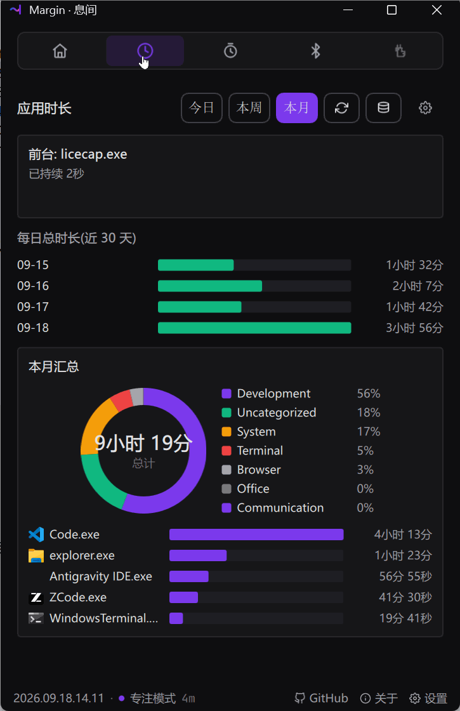
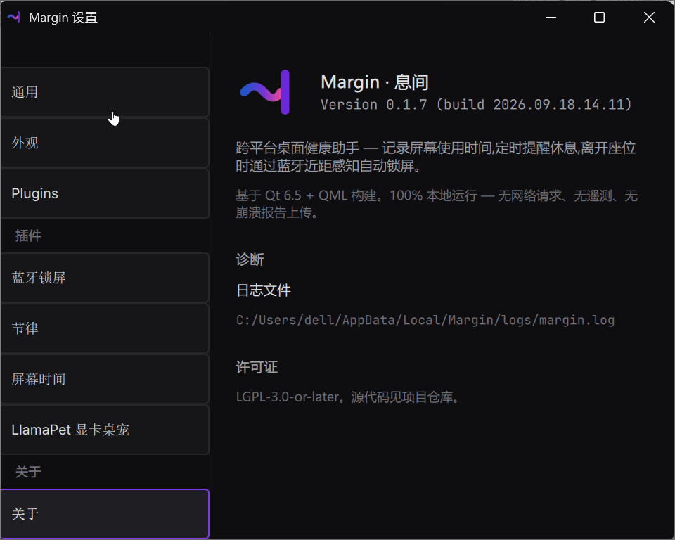
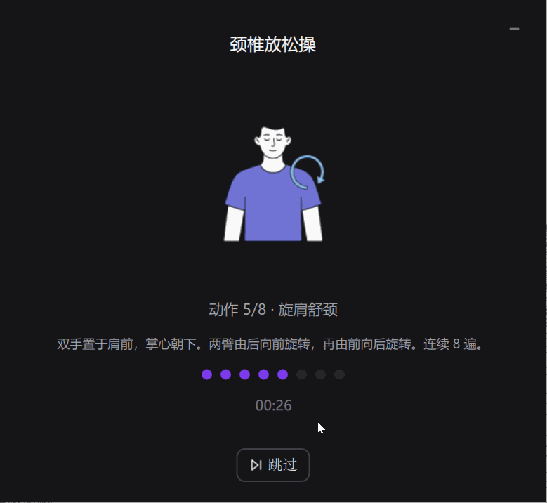
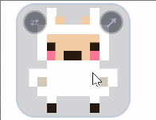
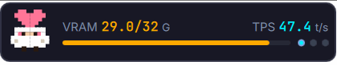
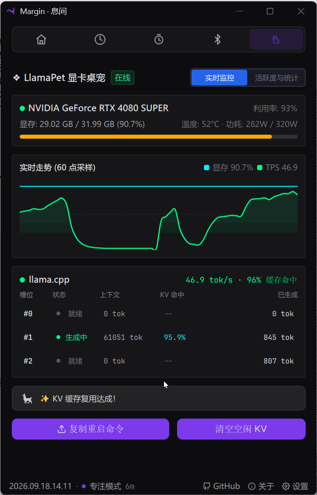

## 也许是目前性能最好、最克制、最懂打工人的开源桌面工具之一 

> 光标留白，是"息间"；托盘一隅，是"Margin"

之前有很多想法，想写各种功能的软件；但碍于能力、个人精力等都没去实施；但是现在不同了，VibeCoding让各种想法都能变为现实，Margin.息间正是我各种想法的VibeCoding作品，全程没手敲一行代码，全部依靠海外与国内前沿大模型打工搓出（除了这个推广文案，真的没手敲一行代码/文档）。

开源地址: https://github.com/U13tor/Margin 已经设置好了构建流水线，安装包都是 GitHub Actions 自动编译发布的。因为个人开源作品无数字签名，可能部分浏览器或杀软下载时会提示风险，不放心的朋友完全可以把代码 clone 下来自己编译。

## 0x0 简介

> 开发技术栈（Qt原生开发、qml实现界面）、软件架构(插件化加载、每个插件都可设置是否加载)、核心优势(Qt原生开发 性能好 单进程，内存占用少)

现在市面上的桌面工具，动不动就套个 Electron 或者内嵌一整个 Chromium 浏览器。哪怕只是写个简单的便签或待办清单，开机就要吃掉七八百兆甚至 1G 内存，后台托盘多挂两个，风扇就开始嗷嗷转，电脑卡得怀疑人生。

作为一名常年泡在电脑前、饱受各种套壳全家桶折磨的野生开发者兼重度打工人，我想要的桌面工具必须足够克制、轻巧、懂事，而且绝对不偷鸡摸狗。于是就有了 **Margin（息间）**：

- **纯正的 C++ / Qt 6.7 + QML 原生开发**：彻底抛弃网页套壳方案，采用单进程原生架构。平时静默常驻在 Windows 系统托盘里，**插件全开，内存占用 200MB左右，空闲时 CPU 占用近乎 0%**，启动秒开，动画如丝般顺滑，绝不抢占你的 IDE、编译环境或生产力资源。
- **模块化插件架构（Host + Plugin + EventBus）**：大家用软件最烦捆绑大礼包。Margin 核心只负责提供基础设施，四大功能全部做成了独立的动态库插件（`.dll`）。**每个插件都可以在设置面板里单独开启或关闭**（如上图动图所示），不想要的功能随手一点就彻底卸载，多 1KB 内存都不占，坚决不搞后台偷偷自启那一套。
- **极致的隐私洁癖（真·零外网请求、零遥测、纯本地加密）**：
  - **零网络调用**：软件没有更新弹窗、没有行为埋点、没有崩溃上报。除了 LlamaPet 插件访问本机 `localhost` 本地端口与大模型通信外，底层配有代码级 `LoopbackGuard` 拦截网，任何外网请求一律就地掐死，大家尽管拿 Wireshark 随便抓包验证！
  - **无需登录即开即用**：没有用户体系，不收集手机号、邮箱或任何设备指纹。
  - **本地端到端加密**：所有数据均存储在本地 SQLite 数据库中。涉及敏感的应用记录与配置均采用 **AES-256-GCM** 加密，密钥托给 Windows 原生 **DPAPI** 保护，数据是你的，也永远只属于你。

## 0x1 主要功能

> 介绍下Margin核心插件功能，每个功能具体干啥

### Aura Locker
> 很多公司有规定人离开必须锁屏，不然要处罚；基于这样背景有了这个插件功能，基于蓝牙广播 实现离座锁屏，电脑必须要有蓝牙，自己有一个可发送蓝牙广播手表，设置好后 离开电脑后会自动锁屏

- **痛点扎心**：在很多中大厂、外企、金融机构或安全规范严格的单位，都有“离座必锁屏”的硬性规定，忘了锁轻则被同事抓包整蛊发群消息请喝奶茶，重则被安全巡检抓拍通报扣绩效；就算没有考核，起身去接水或上洗手间时，屏幕上还摊着机密代码、敏感聊天记录或摸鱼页面，路过的人瞄上一眼总让人心里一紧。
- **优雅解法**：市面上有些方案用摄像头怼脸识别人脸离开（天天被镜头对着不仅费电，心里还直犯嘀咕），或者自制红外单片机硬件（折腾成本极高）。Margin 的解法相当极客且无感——**利用低功耗蓝牙（BLE）广播信号强度（RSSI）被动测距**！
  只要你手上戴着支持 BLE 广播的智能设备（比如小米手表、Apple Watch、华为手环等日常穿戴设备），在设置里一键配对（如前面的设置动图所示），设定好离开阈值：
  **一旦你离开工位约 5 米、超过 30 秒，Margin 就会自动触发系统锁屏！深藏功与名。**
- **防抽风设计**：担心在工位旁边走动导致频繁误锁？插件专门内置了**离座确认缓冲**与**回座 60 秒冷却保护期**，确保不会因为蓝牙信号轻微波动而神经质地反复锁屏，无感守护，不打乱你的工作心流。

### Screen Time Tracker
> 类似手机上的屏幕时间，基于被动监控非轮询实现窗口监控统计每个电脑终端应用时长，可以看自己每天都在用电脑干嘛，是努力工作还是在摸鱼 哈哈

- **痛点扎心**：每天在电脑前坐得腰酸背痛，下班复盘时却一脸茫然：今天时间到底都去哪儿了？到底是在 IDE 里写了 6 个小时业务代码，还是在各大摸鱼网站高强度冲浪了 3 个小时？
- **告别流氓做法，做纯正的被动事件驱动**：
  电脑上的时间统计软件不少，但许多为了省事直接在后台开死循环定时轮询，把 CPU 搞得持续发热；更有甚者直接挂全局键盘钩子，杀毒软件一天报毒三次，还把你的账号密码隐私全看光了。
  Margin 坚决不这么干，它采用 Windows 原生的 **WinEventHook** 被动监听机制：只有当你真正用鼠标点击或者 Alt+Tab 切换前台窗口的瞬间，系统才会给 Margin 发送微秒级回调通知。**0 轮询、0 键盘记录、完全零开销**。
- **一目了然的时间看板**：
  如上图所示，以优雅清晰的暗色环形图和分类条形图展示数据：开发（IDE/编辑器）、终端（Terminal）、浏览器、办公软件等各占百分之多少，支持【今日】、【本周】、【本月】以及近 30 天每日总时长趋势汇总。到底是谁在偷偷加班、谁在惬意摸鱼，数据从不撒谎！

### Rhythm & Health
> 核心功能定时提醒做颈椎操，程序员最后都是劲椎病的康复治疗，这个功能主要目的是延缓这个过程，健康工作五十年

- **痛点扎心**：很多长期伏案的重度电脑使用者最大的职业健康风险，往往是提前突出的 C4-C5 颈椎间盘。敲起代码或处理工作上头了，在椅子上一瘫就是几个小时，站起来时脖子像生了锈的轴承一样咔咔响。市面上的番茄钟到时间就在角落弹个小窗，大家基本顺手就叉掉了，该驼背还是接着驼背。
- **真带你动起来的颈椎放松操**：
  Margin 的健康模块不仅内置了经典的番茄工作法（25分钟专注 / 5分钟休息），最实用的是在休息时段直接弹出全屏的【颈椎放松操引导窗口】（看上面动图）：
  内置了 **8 节专业颈椎放松操动画与图文要领**（如动作 7/8“颈项争力”、“左顾右盼”、“前俯后仰”等），配合舒缓的倒计时引导。休息那几分钟别再低头刷手机了，跟着图示动一动脖子和肩膀，真正保住打工人的革命本钱。当然，遇到线上紧急排障救火，也贴心支持一键跳过，绝不强行打断重要操作。
- **绝妙联动**：它还跟上面的 **Aura Locker 蓝牙锁屏**全面打通了！如果你中途起身去洗手间或倒水，电脑自动锁屏的同时，**番茄钟会自动挂起暂停**；等你回到工位坐下，计时才会自动继续。绝不浪费你的休息时间，也不把走动离开算作专注时长。

### LLamaPet
> 又一个核心功能，看显卡状态、本地模型跑得溜不溜，还有个可爱的羊驼浮窗

- **本地大模型极客专属利器**：
  现在不少开发者和 AI 玩家本地都配了高性能独立显卡，日常用 llama.cpp、Ollama、vLLM 跑各种开源大模型。但监控推理状态一直是个痛点——要么在后台挂着黑乎乎的终端看滚动日志，要么时不时敲 `nvidia-smi` 监明显存。不仅不直观，而且毫无交互乐趣。
  Margin 直接把原先独立开发的显卡桌宠深度插件化集成到了这里！
- **三种形态，自由切换**：
  1. **MiniPet 桌宠形态（96×96 像素羊驼）**（图一）：一只可爱的 8-bit 点阵像素小羊驼趴在你的桌面上，内置 **7 态情绪状态机**——闲置时打瞌睡，推理启动时开始快速咀嚼，高负载生成时两眼冒出小爱心，要是显存逼近 96% 红线还会进入惊恐抓狂态！
  2. **Dock 胶囊形态（260×50 状态栏）**（图二）：想要极简风格的朋友可以直接切成横条胶囊，实时显示 VRAM 显存（如 `29.0 / 32 G`）以及生成的吞吐速度（如 `47.4 t/s`），贴在任务栏角落极其清爽。
  3. **GeekHUD 深度仪表盘（主面板原生 Tab）**（图三）：集成在主窗口的硬核监控台，包含 60 点 VRAM / TPS 实时双轨动态曲线，推理波动一览无遗。
- **硬核深度遥测，绝非表面功夫**：
  - **NVML 驱动级直连**：直接通过 `nvml.dll` 驱动层抓取显存、核心利用率、实时功耗（如 319W/320W）与核心温度，无驱动环境优雅自动降级到 `nvidia-smi`；
  - **llama.cpp 深度状态与 Slot 槽位监听**：直接接入 `/slots` 与 `/health`，实时展示各个并发槽位状态（就绪、生成中、上下文 token、已生成量）以及实测 TPS 吞吐；
  - **KV Cache 命中率与一键清空**：多轮长对话显存被陈旧上下文挤爆？Margin 会实时计算 KV Cache 复用率，并提供**一键清空空闲 KV** 按钮，点一下立刻释放显存！
  - **贴心桌面交互**：支持屏幕边缘 ≤20px 自动磁吸、Peek 3 秒自动半隐藏（只露出一对眼睛在边缘暗中观察）、Win32 鼠标穿透以及全局唤出快捷键 `Ctrl+Alt+P`，码字打游戏完全不遮挡视线。

## 0x2 最后

> 希望大家多多使用、多提想法、建议，有能力的朋友可以一起来开发

项目采用完全透明的 **LGPL-3.0-or-later** 开源协议，所有代码已上传至 GitHub，并配置了自动化 CI/CD 构建流水线。

作为一次纯粹由 AI 辅助生成的 **VibeCoding 探索**，整个项目从架构设计、C++ 核心、QML 现代化界面到 Win32/BLE/NVML 各种底层系统调用，全靠海外与国内先进大模型协同编写。这证明了在今天，只要你有好的想法和对产品体验的执着，再复杂的跨平台原生桌面软件也能一人成军。

欢迎大家下载体验！如果有任何 Bug 反馈、体验建议，或者有天马行空的新插件点子，欢迎在各大社区交流、到 GitHub 提 Issue 或提交 PR！

开源不易，如果觉得还算好用顺手，欢迎顺便给仓库点个 **Star** 支持一下，非常感谢大家！