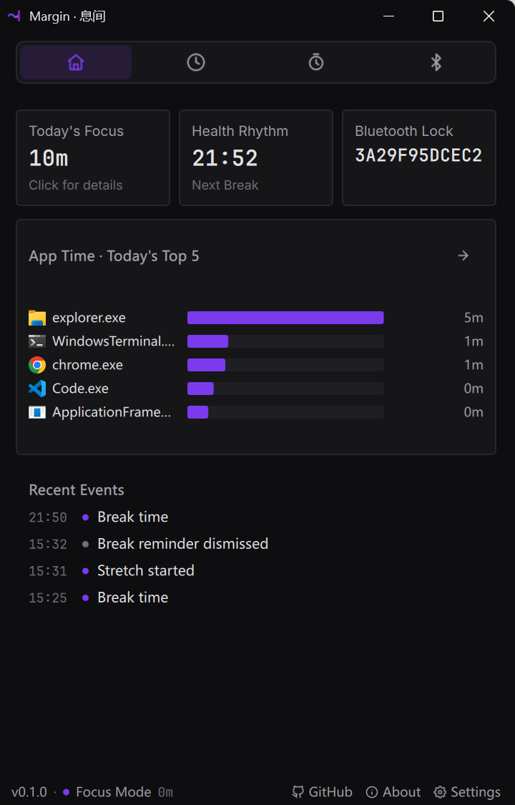

  <strong>English</strong> | <a href="README_ZH.md">中文</a>

# Margin

  

  <em>A privacy-first digital wellness companion that lives in your system tray. 
  100% on-device · Zero network calls · Zero telemetry · Open source.</em>

  
  
  
  
  

  

---

A lightweight digital wellness tool for developers and power users, living quietly in your system tray. Built on a **Host + Plugin + EventBus** architecture, Margin runs **entirely offline — zero network access, zero telemetry, fully open source**. The UI supports both **English and Chinese** with in-app language switching.

## Core Features

### 🔒 Aura Locker — Walk Away, Auto-Lock

Bluetooth RSSI-based proximity detection — no GATT connection, no polling. When your paired device (phone, watch, or headphones) moves ~5 meters away for 30+ seconds, Margin locks your workstation automatically. A 60-second cooldown prevents repeated locks when you return. **Invisible protection that never interrupts your flow.**

### 📊 Screen Time Tracker — Silent Usage Logging

Passively captures foreground app switches via OS events (`SetWinEventHook` on Windows) — no polling, not a keylogger. Sensitive fields (e.g. window titles) are encrypted with **AES-256-GCM**, keys stored in the OS keyring (Windows DPAPI / macOS Keychain). Privacy and analytics, without compromise.

### 🍅 Rhythm & Health — Pomodoro + Guided Stretch Breaks

Classic Pomodoro timer (25 min work / 5 min rest) with Aura integration: auto-pauses when you step away, resumes when you return. During breaks, a guided neck-stretch window appears with **8 exercise routines**, countdown timers, and step-by-step instructions to help you recharge between sessions.

> 📸 See detailed screenshots in [docs/02-install.md](docs/02-install.md).

---

## Privacy Commitment

- **Zero Network** — No heartbeat, no update checks, no crash reports. Verify with Wireshark
- **Zero Telemetry** — No usage data collected, all logs stay local
- **No Account Required** — No login, no tokens, works out of the box
- **End-to-End Encryption** — Sensitive fields encrypted with AES-256-GCM, keys remain in the OS keyring
- **Your Data, Your Rules** — Export anytime (JSON / CSV) or delete everything permanently

> Full privacy design and threat model: [docs/07-privacy-security.md](docs/07-privacy-security.md).

---

## Quick Start

**Pre-built binaries** (recommended): Head to [GitHub Releases](https://github.com/U13tor/Margin/releases). Windows users can choose the `.exe` installer (no admin required) or the portable zip (extract and run). See [docs/02-install.md](docs/02-install.md).

**Build from source**: Requires Qt 6.7+, CMake 3.21+, vcpkg, and Visual Studio 2022. See [docs/03-build-from-source.md](docs/03-build-from-source.md).

| | Spec |
|---|---|
| **System** | Windows 10 1809+ (x64); macOS / Linux — see Roadmap |
| **Footprint** | Install < 80 MB · RAM < 80 MB · Idle CPU < 1% |
| **Privileges** | Per-user install, no admin required |

---

## Roadmap

### v1.0 — Current Release ✅

Windows MVP shipped. All three core plugins (Aura Locker / Screen Time / Rhythm & Health) are fully functional, with a stable plugin architecture and permission model.

### v1.1 — Cross-Platform Expansion

- 🍎 **macOS Backend** — Full adaptation of Bluetooth, screen time, and Pomodoro modules for macOS
- 🐧 **Linux Support** — Bluetooth backend via BlueZ / D-Bus
- 📤 **Enhanced Data Export** — Visual reports, weekly / monthly aggregation
- 🌐 **i18n Improvements** — Complete English localization, community translation support

### v2.0 — Future Vision

- 🧩 **Plugin Marketplace** — Open third-party plugin distribution and management
- 🤖 **Smart Fatigue Detection** — Explore on-device models for eye strain and posture analysis (maintaining the zero-network promise)
- 📱 **Mobile Companion** — LAN-based phone pairing for syncing health data and reminders

> The roadmap evolves with community feedback — share your ideas on [GitHub Issues](https://github.com/U13tor/Margin/issues).

---

## Documentation

| Document | Topic |
|---|---|
| [01-architecture.md](docs/01-architecture.md) | Architecture, startup & shutdown sequences |
| [02-install.md](docs/02-install.md) | Installation & first run |
| [03-build-from-source.md](docs/03-build-from-source.md) | Building from source |
| [04-plugin-spec.md](docs/04-plugin-spec.md) | Plugin ABI, manifest & permission model |
| [05-host-services.md](docs/05-host-services.md) | Host Services API reference |
| [06-platform-support.md](docs/06-platform-support.md) | Platform support matrix |
| [07-privacy-security.md](docs/07-privacy-security.md) | Privacy, encryption & threat model |
| [09-testing.md](docs/09-testing.md) | Testing strategy & local verification |

---

## Contributing & Contact

Pull requests, issues, and all forms of feedback are welcome!

- Contributing guide: [CONTRIBUTING.md](docs/CONTRIBUTING.md)
- Bug reports & suggestions: [GitHub Issues](https://github.com/U13tor/Margin/issues)
- Repository: [github.com/U13tor/Margin](https://github.com/U13tor/Margin)

## License

[LGPL-3.0-or-later](LICENSE) — Every `.h` and `.cpp` file includes `SPDX-License-Identifier: LGPL-3.0-or-later`.
